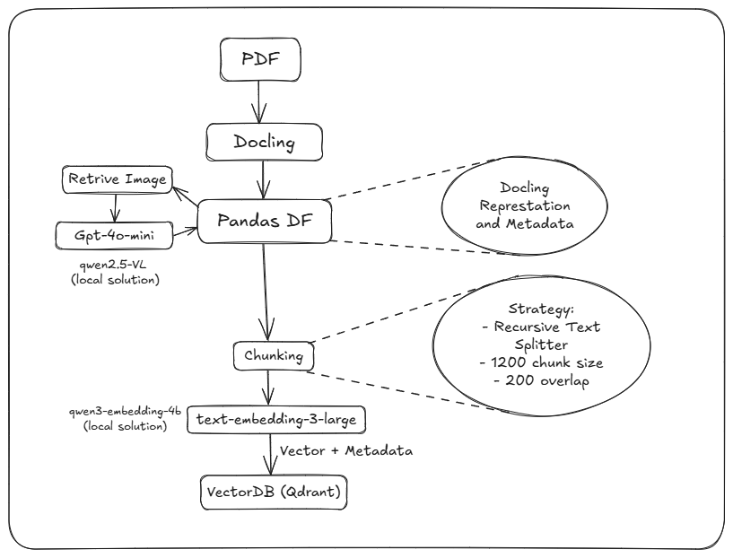
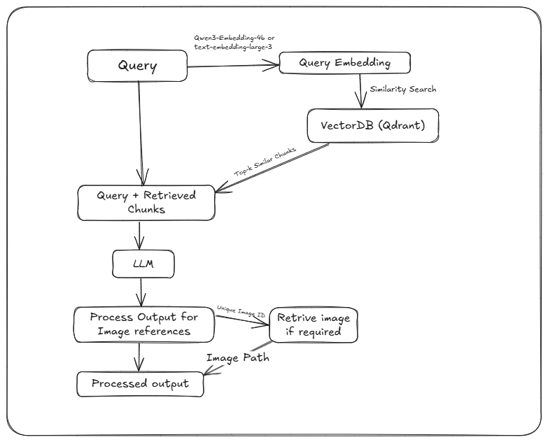

# Technical Documentation: Smart-RAG

## 1. Introduction

This document provides a thorough explanation of the methods and reasoning behind the Smart-RAG application. The project is a Retrieval-Augmented Generation (RAG) system designed to allow users to ask questions about their private documents and receive accurate, context-aware answers.

The system is composed of two main parts:
-   A **FastAPI backend** that handles the heavy lifting of data processing, ingestion, and retrieval.
-   A **Streamlit frontend** that provides a user-friendly interface for interacting with the system.

## 2. Data Ingestion Pipeline

The ingestion pipeline transforms PDF documents into searchable vector embeddings through multiple specialized processing stages, optimized for comprehensive document understanding.

### 2.1. PDF Input

PDF format was selected as the primary input format due to its prevalence in the given documents. The pipeline is specifically optimized for text-extractable PDFs rather than scanned documents as provided documents were all text extractable.

### 2.2. Docling

Docling was selected over traditional PDF parsers for its superior capabilities in structure preservation, table recognition and multi-element handling (text,images,and tables)

### 2.3. Image Processing

The images detected by docling is send to a vision model to retrieve descriptions about the image. Various charts, diagrams, infographics can be analysed with this.

### 2.4. Chunking Strategy

Recursive Text Splitter was used as the chunking strategy with 1200 chunk size and 200 overlap. This configuration ensures that related information remains accessible while optimizing for retrieval accuracy. 

### 2.5. Text Embedding

OpenAI's text-embedding-large-3 is used in this project. However we can easily switch to local solutions such as qwen3-embedding models.

### 2.6. Vector Storage

Qdrant was chosen to be the vector storage as provides an easy to use and is optimized for high-speed similarity search operations.

## 3. Retrieval and Q&A Pipeline

The retrieval pipeline is activated when a user asks a question through the Streamlit interface.

### 3.1. Query Processing

User queries undergo identical embedding processing using text-embedding-3-large, ensuring vector space alignment with ingested documents.

### 3.2. Similarity Search

The query embedding is used to perform a similarity search in the specified Qdrant collection. The search returns the top N most similar document chunks, which form the context for the LLM.

### 3.3. Prompt Engineering and LLM Response

1.  **Prompt Engineering**: A carefully crafted prompt is sent to the LLM (`gpt-4o-mini`). This prompt is crucial for getting accurate and well-formatted answers. The prompt instructs the LLM to:
    -   Answer the user's query based *only* on the provided context.
    -   If the answer is not in the context, to state that it doesn't know.
    -   To reference figures using the exact format `[figure: unique_id]` and to *never* invent figure IDs.
    -   An example is provided in the prompt to guide the LLM on the expected behavior.
2.  **LLM Response**: The LLM generates a response based on the query and the retrieved context.

### 3.4. Figure Display in Frontend

1.  **Response Parsing**: The Streamlit application receives the LLM's response and scans it for `[figure: unique_id]` tags.
2.  **Image Retrieval**: For each figure tag found, the image path is retrived.
3.  **Display**: The image is then displayed in the Streamlit interface, providing a seamless experience for the user.

